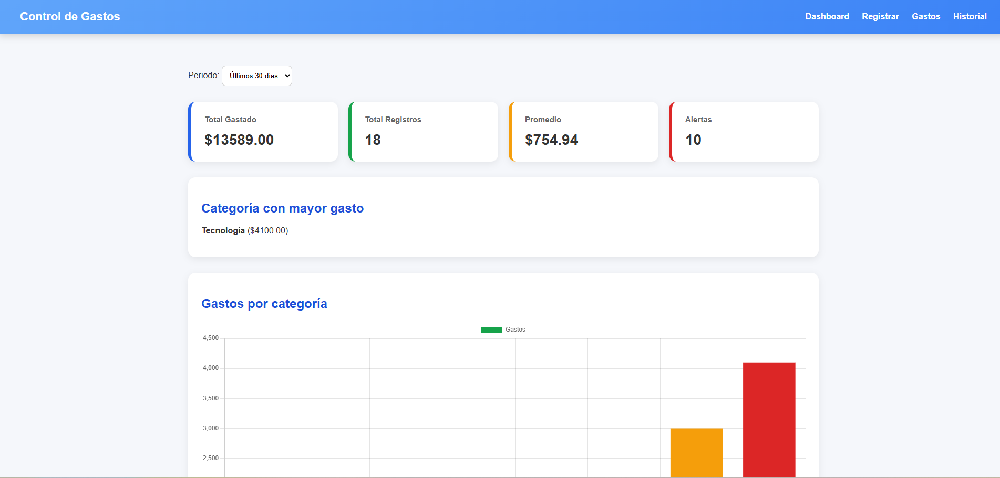
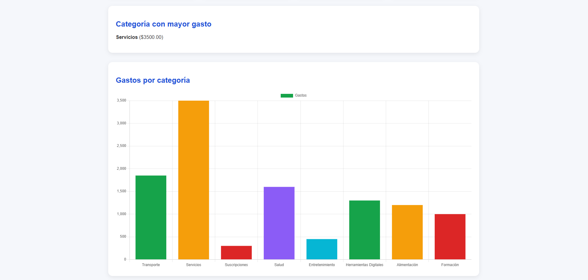
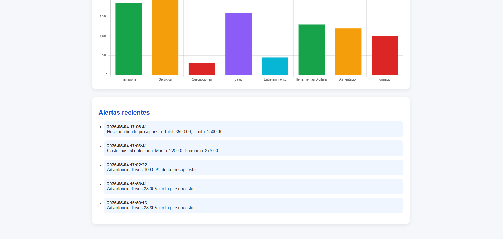
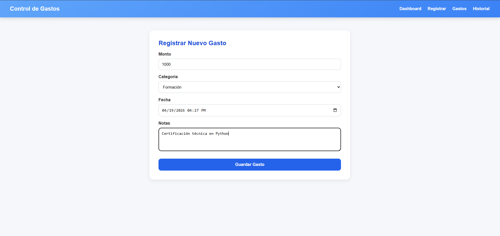
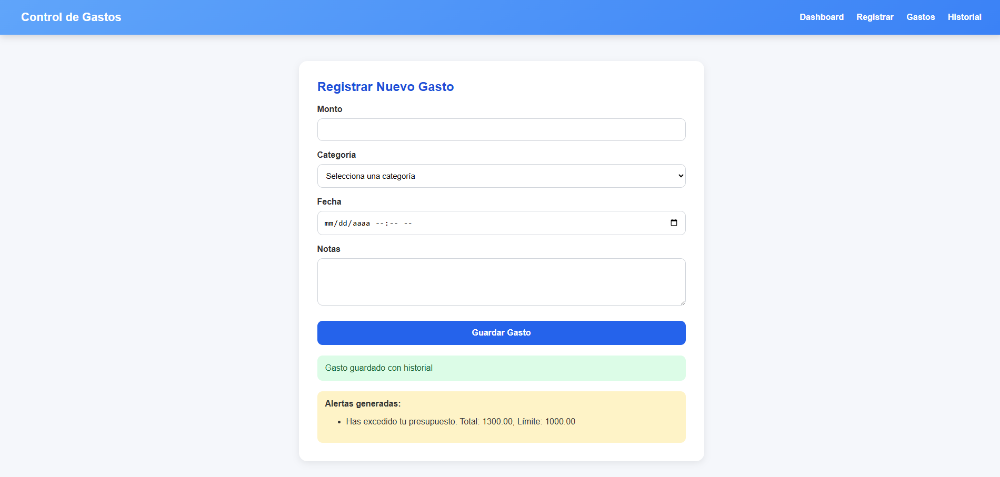
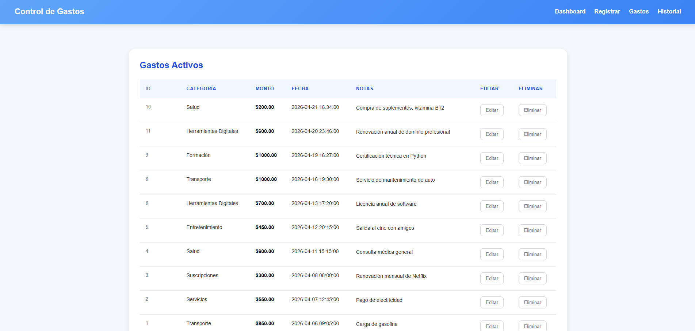
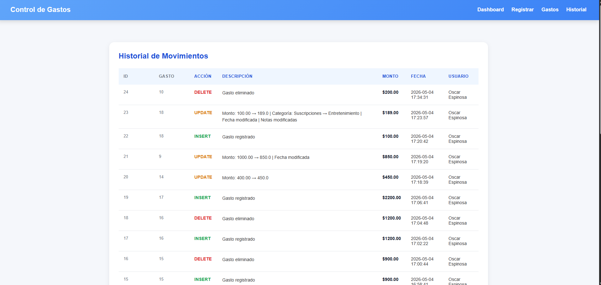

# Gestor de Gastos Inteligente

Sistema web de gestión financiera personal desarrollado con Flask y MySQL, enfocado en trazabilidad de movimientos, monitoreo presupuestario y generación automática de alertas inteligentes.

## Descripción

Gestor de Gastos Inteligente permite registrar movimientos financieros, visualizar métricas clave y generar alertas automáticas en función de presupuesto y comportamiento histórico.

## Demo en vivo

🔗 https://gestor-gastos-inteligente.onrender.com/dashboard-view

## Objetivo del proyecto

Este proyecto fue desarrollado como parte de mi transición profesional hacia desarrollo backend con Python y análisis de datos, con énfasis en diseño de lógica de negocio, modelado relacional y trazabilidad de información financiera.

El sistema está diseñado con enfoque en:

- Análisis de datos
- Trazabilidad y auditoría
- Control financiero
- Arquitectura backend modular

---

## Funcionalidades principales

### Registro y gestión de gastos

- Registro de gastos con:
  - Monto
  - Categoría
  - Fecha
  - Notas
- Edición de gastos existentes
- Eliminación lógica (soft delete) para conservar historial
- Listado de gastos activos

### Auditoría histórica

- Historial de inserciones, actualizaciones y eliminaciones
- Registro del usuario responsable
- Descripción de cada cambio
- Fecha y monto de cada operación

### Alertas inteligentes

- Detección de presupuesto excedido
- Advertencia cuando se alcanza el 80% del presupuesto
- Identificación de gasto inusual respecto al promedio histórico de la categoría

### Dashboard analítico

- Total gastado
- Promedio de gasto
- Número total de movimientos
- Categoría con mayor gasto
- Alertas recientes
- Distribución de gasto por categoría
- Filtro por periodo (1, 7 y 30 días)

---

## Rutas principales del sistema

Las rutas están implementadas en `routes/gastos.py` y gestionan tanto la interacción con las vistas HTML como la lógica de negocio del sistema.

### Gestión de gastos

- `GET /registrar-gasto`  
  Muestra el formulario para registrar un nuevo gasto.

- `POST /registrar-gasto`  
  Procesa el registro del gasto, genera alertas automáticas y registra el movimiento en historial.

- `GET /gastos-view`  
  Muestra el listado de gastos activos.

- `GET /editar-gasto/<id_gasto>`  
  Muestra el formulario de edición de un gasto existente.

- `POST /editar-gasto/<id_gasto>`  
  Actualiza la información del gasto y registra la modificación en historial.

- `GET /eliminar-gasto/<id_gasto>`  
  Ejecuta eliminación lógica (soft delete) del gasto y registra el evento.

---

### Visualización y análisis

- `GET /dashboard-view`  
  Muestra métricas generales, distribución de gastos y alertas recientes.

- `GET /historial`  
  Visualiza el historial completo de movimientos realizados sobre los gastos.

- `GET /alertas`  
  Consulta las últimas 5 alertas generadas por reglas presupuestarias y detección de anomalías.

---

### Consideraciones técnicas

- Todas las operaciones críticas generan trazabilidad automática en `gastos_historial`
- Las eliminaciones son lógicas (`activo = FALSE`)
- Las alertas se almacenan persistentemente en la tabla `alertas`
- La lógica de validación presupuestaria se ejecuta automáticamente al registrar cada gasto

---

## Tecnologías utilizadas

### Backend

- Python
- Flask
- `mysql-connector-python`
- `python-dotenv`

### Base de datos

- MySQL

### Frontend

- HTML
- CSS
- Jinja2

---

## Arquitectura del sistema

```
gestor-gastos-inteligente/
├── .env                  # Variables sensibles (excluido del repositorio)
├── .env.example          # Plantilla de configuración
├── .gitignore            # Configuración de Git
├── app.py
├── database.py
├── database.sql          # Script SQL para crear tablas y datos iniciales
├── README.md
├── requirements.txt      # Dependencias Python
├── routes/
│   └── gastos.py
├── screenshots/
│   ├── confirma_gasto_registrado.png
│   ├── dashboard(1).png
│   ├── dashboard(2).png
│   ├── dashboard(3).png
│   ├── gastos_activos.png
│   ├── historial.png
│   ├── presupuesto_excedido.png
│   └── registrar_gasto.png
└── templates/
    ├── dashboard.html
    ├── editar_gasto.html
    ├── gastos.html
    ├── historial.html
    ├── pruebas.html
    └── registrar_gasto.html
```

---

## Características técnicas destacadas

### Conexión segura con variables de entorno

- `database.py` usa `python-dotenv` para cargar credenciales desde un archivo `.env`
- variables esperadas: `MYSQL_HOST`, `MYSQL_USER`, `MYSQL_PASSWORD`, `MYSQL_DATABASE`

### Soft Delete

- Los gastos se marcan como inactivos en lugar de eliminarse físicamente
- Se preserva el campo `deleted_at`
- Permite mantener historial y trazabilidad

### Auditoría de cambios

- Cada operación de inserción, actualización y eliminación deja un registro en `gastos_historial`
- Se almacena la acción, monto, usuario y descripción del cambio

### Alertas basadas en reglas

- Se genera una alerta cuando se excede el presupuesto configurado por categoría
- Se genera una alerta al superar el 80% del presupuesto
- Se genera una alerta cuando un gasto es mayor al doble del promedio histórico de la misma categoría
- Las alertas se almacenan en la tabla `alertas` con su tipo y mensaje descriptivo

---

## Instalación local

### Clonar repositorio

```bash
git clone TU_URL
cd gestor-gastos-inteligente
```

### Crear entorno virtual

```bash
python -m venv venv
```

### Activar entorno virtual

**Windows:**

```bash
venv\Scripts\activate
```

**Mac/Linux:**

```bash
source venv/bin/activate
```

### Instalar dependencias

```bash
pip install -r requirements.txt
```

### Configurar variables de entorno

Renombra `.env.example` a `.env` y actualiza tus credenciales:

**Windows:**
```powershell
copy .env.example .env
```

**Mac/Linux:**
```bash
cp .env.example .env
```

Luego edita `.env` con tus datos:

```env
MYSQL_HOST=localhost
MYSQL_USER=tu_usuario
MYSQL_PASSWORD=tu_contraseña
MYSQL_DATABASE=gastos_personales
```

### Importar esquema de base de datos

Desde MySQL CLI:

```bash
mysql -u tu_usuario -p < database.sql
```

O desde MySQL Workbench/phpMyAdmin:

1. Abre `database.sql` en tu cliente MySQL
2. Ejecuta el script (crea la BD, tablas y datos iniciales)

> El script incluye: usuarios, categorías, gastos, presupuestos, tipos_alerta, alertas, gastos_historial

### Ejecutar servidor

```bash
python app.py
```

Abrir en el navegador:

```
http://127.0.0.1:5000
```

---

## Capturas del sistema

### Dashboard







### Registro de gastos



### Alertas



### Gestión de gastos



### Historial de auditoría



---

## Próximas mejoras

- Autenticación de usuarios
- Filtros avanzados y búsqueda por fechas/categorías
- Exportación a PDF / Excel
- API REST completa con documentación OpenAPI
- Despliegue en Render / Railway / AWS

---

## Autor

**Oscar Espinosa Torres**

Desarrollador Backend en formación con enfoque en Python, análisis de datos y desarrollo de software.

